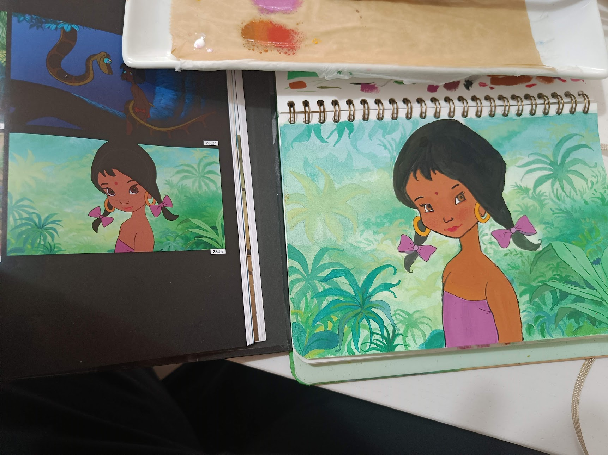
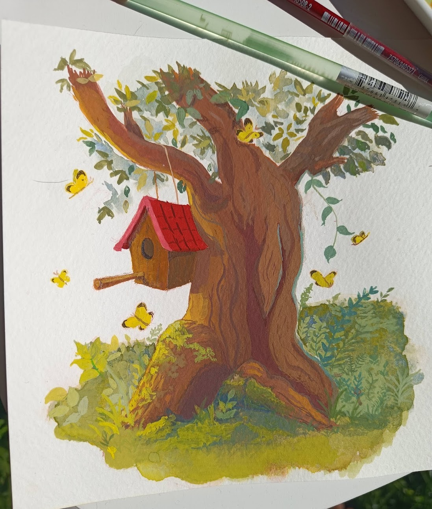

In this blog post I want compile all/most of the art studies I do. For each of them I want to focus on 2 things I did well-ish, 2 things I did not as well and a concrete thing I want to focus on improving in the next study. It's simply a way for me to not forget to learn from my practice sessions. 

---
## 11 March 2025

### Scene Study - Jungle book

#### Things I did well

- I more or less got the colors good despite how frustrating the drying gouache felt at the time.
- I guess I like that I gave the right bow a bit more dimension 🤷‍♀️

#### Things I did not do well

- I don't like the leaf shapes I made (especially the loopy looking ends I gave to some of the palm leaves)
- The black outline is too messy (so are the solid blocks of colors but I'm cheating by listing more than 2 negatives).

#### One concrete thing I can improve in the next study

- Do not use transparent paint when doing the outline.

---

## 20 March 2025

### Master study after Allison Aletha's tree vignette

#### Things I did well

- Grooves and colors of the tree look nice to me
- I like that I challenged myself to do a value study for this one (even though I didn't do it well).

#### Things I did not do well

- The plant shapes feel too cluttered and extra-overlapping making it a bit messy.
- The butterflies aren't well designed to fit in the composition.

#### One concrete thing I can improve in the next study

- Try to finish the painting in under 6 hours.
