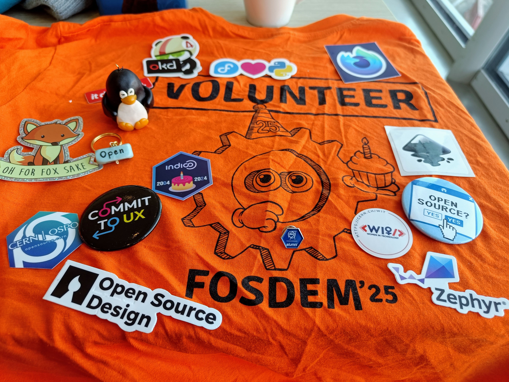

This year the stars aligned and I finally found the perfect opportunity to attend FOSDEM!

What's FOSDEM, you ask?

[FOSDEM](https://fosdem.org/2025/about/) an annual event run by volunteers to celebrate and promote free and open source software.
It takes place the same time (1st weekend of February) and at the same place - [ULB, Brussels, Belgium](https://www.openstreetmap.org/?mlat=50.812375&mlon=4.38073#map=12/50.8124/4.3807).

I was actually sort of nervous about attending the conference. The last time I attended a conference was probably in 2015 and it was a rather small one.
I also had to go the conference alone which added to the anxiety.

If you're in the same boat as me, I've got tips that might help calm though damn nerves!

1. **Sign up for volunteering** - This might sound counter-intuitive but it is deceptively effective. Two of the main reasons why people attend conferences is to network and to learn.
Volunteering is a great catalyst for both - by putting yourself out there, you find more opportunities to meet people (and have a great excuse for introducing yourself beyond just 
"hey, I like the work you/your company does. Can we talk?" (I've just realized why I suck at networking)) which leads to more networking and learning. Also, I found that getting busy with 
volunteer tasks gave me a sense of confidence (because I knew the venue, the schedule, the speakers, etc better), satisafaction (because I felt useful), and also helped me avoid those awkward
moments where I want to dig a deep hole in the ground and disappear. I volunteered for heralding tasks this year. 
This involved introducing the speakers and the talk to the audience, preventing rooms from getting over-crowded, showing prompts to speakers as they approach the end of their talks, etc. I liked this task!
It forced me to get up on stage and talk! I think it may have even given me the confidence to present a talk next year 🤞.

2. **Ask people if they'd be coming to FOSDEM in advance** - I dug deeep and posted on various forums and chats that I'm a part of (even the ones that I've never really wrote any messages before) that
I'll be attending FOSDEM and would love to meet with people if they're coming to. This helped me meet way more people than I could if I had just showed up at FOSDEM and solely
relied on my awesome skills of approaching strangers. Unfortunately for me, I did this a bit too late so many of the people I knew and wanted to meet couldn't join.
However, most of those people mentioned that they'd love to meet next year which is something I'm really looking forward to ☺️.

3. **Block your calendar in advance** - I realized that one of the reasons I didn't attend FOSDEM before is because I didn't notify my team at work well in advance that I'd be taking holidays 
(to travel to Brussels - FOSDEM is on a weekend so I don't technically need any days off). Like most people, I often take holidays in December so it's really not easy for me to convince myself
to take some days off in February at short notice. Of course, this is a very silly thing to worry about and in most situations is a non-issue, but I'm wired this way. So, this time I blocked 
my calendar and notified my team 6 months in advance 😅 (again, turns out I didn't need to this because I didn't need any holidays). It may have been too early but it did prepare me mentally for the big days.
 

## My experience at FOSDEM

I had a really fun time there! I love open source so it felt so warm and nice to be enveloped in the spirit on FOS for 2 whole days. The people were nice and nerdy - just they way I like them,
I met people who use some of my favourite tools, learned about tools and initiatives that I can't believe I hadn't heard of before (like 
[OpenFoodFacts](https://world.openfoodfacts.org/), [FSFE](https://fsfe.org/index.en.html) and more), and I felt useful as a volunteer. I would definitely do this again next year!

I attended (and "heralded") quite a few talks and they were all really interesting. These are just some of my favourites:
- [How we are defending Software Freedom against Apple at the EU's highest court by Lucas Lasota](https://fosdem.org/2025/schedule/event/fosdem-2025-5084-how-we-are-defending-software-freedom-against-apple-at-the-eu-s-highest-court/)
- [Using LLMs to support Firefox developers with code review by Marco Castelluccio](https://fosdem.org/2025/schedule/event/fosdem-2025-6422-using-llms-to-support-firefox-developers-with-code-review/)
- [Nobody asks "How is JavaScript?" by Ujjwal](https://fosdem.org/2025/schedule/event/fosdem-2025-4276-nobody-asks-how-is-javascript-/)

My favourite stands were:
- [Open source at CERN](https://opensource.web.cern.ch/welcome-ospo-page) - (not just because I am a proud alumni)
- [FSFE](https://fsfe.org/index.en.html) - They had a really cool project - a beautifully illustrated children's book to teach why free and open source software/hardware matters today. As an engineer
and an (amateur) artist I really resonated with this project.

## Advice to my future self

- Stay in Brussels for a little while longer than the weekend - The city seemed pretty massive and diverse. I wish I had some time to walk by the river and explore some parks.
- Volunteer for non-heralding tasks too - As much as I loved heralding, I think it left me pretty drained. I signed up for 6 talks which took upwards of 6 hours of time. I also missed some of 
the talks I wanted to attend.
- Bring more handmade merch - This year I handmade a few knick-knacks (like keychains, back-pins, magnets) around the theme of some of my favourite open source tools to give away for free at FOSDEM.
I sneakily snuck them into one of the corners and when I came back to check up on them a couple hours later they were all gone! This was so heart warming and probably my absolute favourite moments.
I'll be sure to bring more stuff next time.

C'est tout. I'm tired and nobody's really going to read this. If you do though, do lemme know if you'll come by, say hi next year 🤗.
